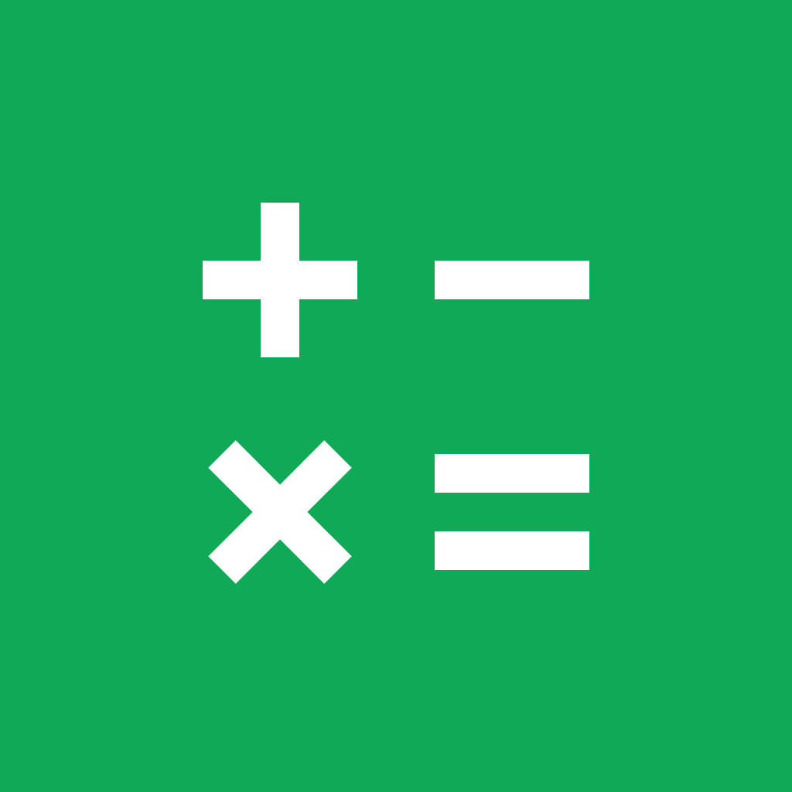
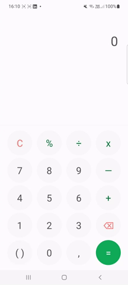
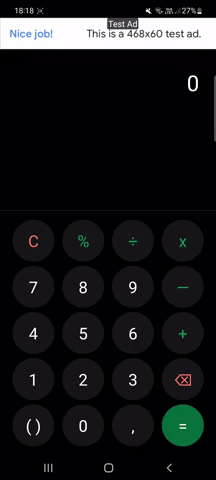
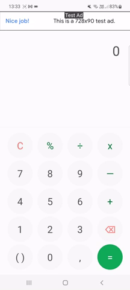

  
  
  
  
  <!--  -->
  
  
   

## Descrição

  O Expression Calculator é uma ferramenta de cálculo matemático que foi criada usando React Native. Ele permite que os usuários realizem operações como adição, subtração, multiplicação, divisão, porcentagem, e também possui recursos para trabalhar com parênteses e números negativos e decimais.    

 

## Download
Para testar o Expression Calculator, basta instalar o arquivo APK gerado pelo Expo. [Clique aqui](https://expo.dev/artifacts/eas/jPJEcrWnh1i75SpDyUHAwz.apk) para fazer o download do arquivo.

## Demonstração
 

## Monetização

  Para monetizar o Expression Calculator, optou-se por utilizar o <a href="https://www.google.com/url?sa=t&rct=j&q=&esrc=s&source=web&cd=&cad=rja&uact=8&ved=2ahUKEwj2n9jS_br8AhUZq5UCHUQaAYYQFnoECAoQAQ&url=https%3A%2F%2Fadmob.google.com%2Fhome%2F&usg=AOvVaw0xBmHkXSnIkhX5iU-yGkoi" target="_blank">Admob</a>,
  uma plataforma gratuita que permite ganhar dinheiro com a exibição de anúncios no aplicativo. Neste caso, foi utilizada a estratégia de 
  <a href="https://docs.page/invertase/react-native-google-mobile-ads/displaying-ads#banner-ads-component" target="_blank">Banner Ads</a>, 
  onde os anúncios são exibidos através de banners. 

 

## Créditos
A layout desta calculadora foi inspirado no [Samsung Calculator](https://play.google.com/store/apps/details?id=com.sec.android.app.popupcalculator).

